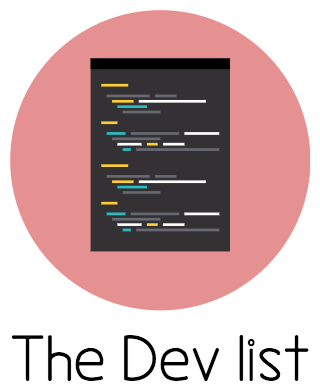

## HTML/CSS Resources
#### [Learn CSS Layout](http://learnlayout.com/)
**Free** Tips, Tricks, and Techniques on using Cascading Style Sheets. 
*(CSS)*

#### [goodui](http://www.goodui.org/)
**Free** The 75 GoodUI ideas that we are about to show you, are being actively A/B tested by us and others. 
*(CSS)*

#### [css-tricks.com](https://css-tricks.com/)
**Free** beginner to intermediate guides on web development  
*(HTML, CSS, JavaScript)*

#### [learn.shayhowe.com](http://learn.shayhowe.com/)
**Free** beginner to intermediate guides on web development  
*(HTML, CSS, JavaScript)*
#### [Codewars](http://www.codewars.com/)
**Free** code challenges. Compare your solution with those of others.  
*(JavaScript, CoffeeScript, Ruby, Python, Clojure, Haskell, Java)*

#### [AllThingsSmitty/must-watch-css](https://github.com/AllThingsSmitty/must-watch-css)
**Free** A useful list of must-watch talks about CSS  
*(CSS)*
#### [Great HTML reference - htmlreference.io](http://htmlreference.io/)
**Free** A free guide to HTML. Learn by example: htmlreference.io.
*(HTML)*
#### [Great CSS reference - cssreference.io](http://cssreference.io/)
**Free** CSS Reference is a free visual guide to CSS. It features the most popular properties, and explains them with illustrated and animated examples.
*(CSS)*